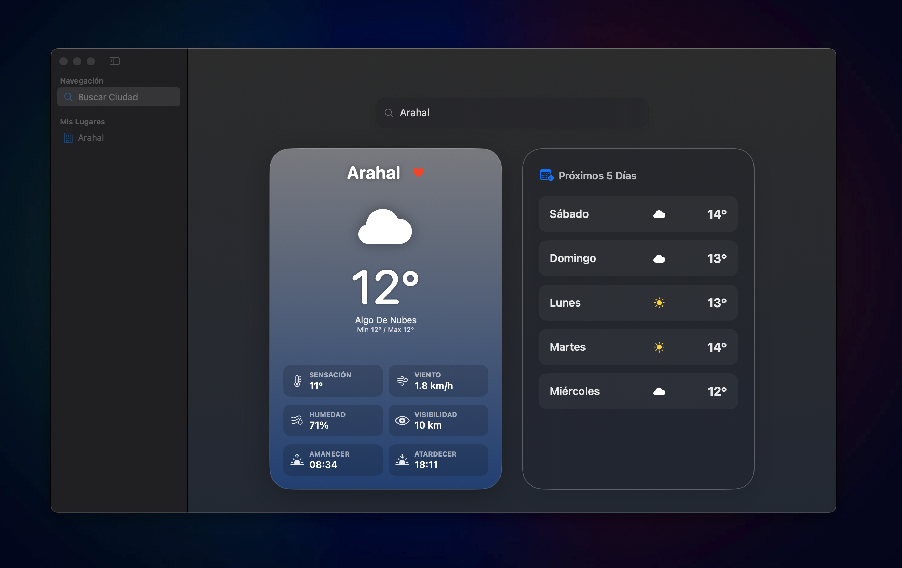

# 📡 AuraWeather

**Tu clima con estilo Apple.** Una aplicación nativa para macOS diseñada con SwiftUI que ofrece una experiencia visual premium y minimalista para consultar el estado del tiempo.

---

## 📸 Captura de Pantalla



---

## ✨ Características

* **Dashboard Inteligente**: Diseño adaptativo que se ajusta al tamaño de tu ventana.
* **Estado en Tiempo Real**: Datos precisos de temperatura, sensación térmica, humedad, viento y visibilidad.
* **Previsión de 5 Días**: Planifica tu semana con un vistazo rápido a los próximos días.
* **Gestión de Favoritos**: Guarda tus ciudades preferidas en la barra lateral para un acceso instantáneo.
* **Efecto Glassmorphism**: Interfaz moderna con materiales traslúcidos y gradientes dinámicos según el clima.

---

## 🛠️ Tecnologías y Arquitectura

* **Lenguaje**: Swift 6.0
* **Framework**: SwiftUI con el nuevo framework de **Observation**.
* **Arquitectura**: Clean Architecture + MVVM (Model-View-ViewModel).
* **API**: [OpenWeatherMap API](https://openweathermap.org/).

---

## 🚀 Configuración

Para ejecutar este proyecto, necesitas añadir tu propia API Key:

1. Clona el repositorio.
2. Crea un archivo llamado `Secrets.xcconfig` en la raíz del proyecto (si no existe).
3. Añade tu clave de la siguiente forma:
   ```config
   WEATHER_API_KEY = tu_api_key_aquí
4. Dale a Run en XCODE

## Hecho con ❤️ por José Manuel Jiménez